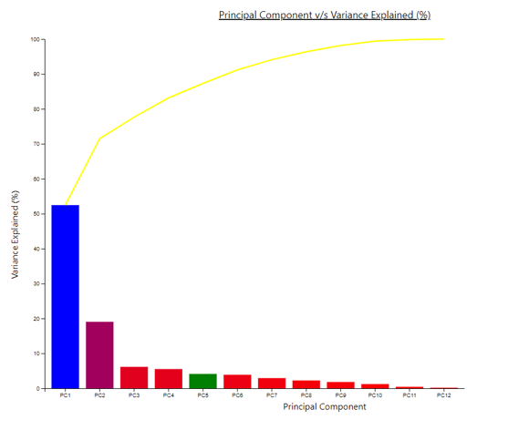
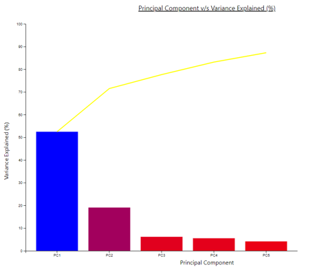
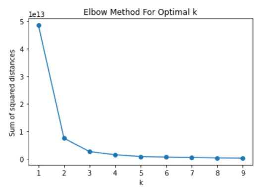
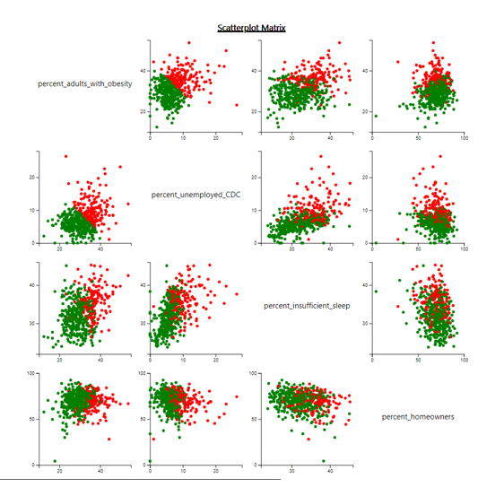
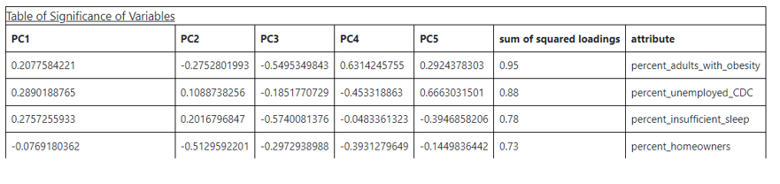
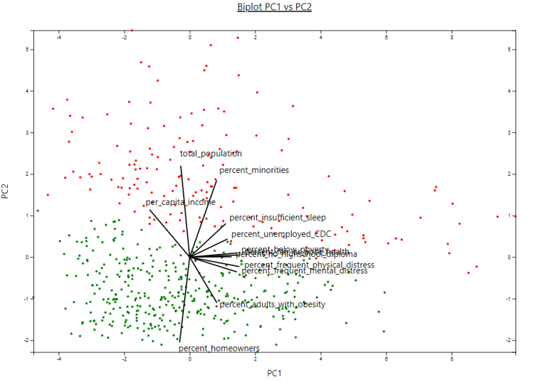

# Visualization Lab 2a
## Prateek Sengar

[Demo](https://youtu.be/vIOKOyaWU6c)

### Dataset
I was very intrigued by the data regarding the Social Health of the United States, hence I decided to go with it and notice some trends. The dataset had 181 columns and 3144 rows from which I chose 15 which I felt would describe the current social and health status of the United States as a whole. There was a lot of preprocessing that went into creating the final dataset. Some examples are removing the excessive columns and rows, dealing with NaN values, etc. The final dataset had 15 columns and 527 rows. Also, entries were each county and rows were selected by taking 3 of the most and least populous counties, and the remaining were average-populated counties for each state.

### Scree Plot
The scree plot plots principal components against the variance explained percentage. The bars are made using the eigenvalues obtained after PCA and the line is plotted using the incremental eigenvalues. I added the colors to the bars so that the PCs that explain the variance the most get a blue color and the color fades to red, which is assigned to the PCs that contribute the least.

I also added the feature to select the bar (which is used while creating the scatter plot matrix. When the bar is selected, its color is changed to green and the last bar that is clicked before switching to scatter plot is selected as the intrinsic dimensionality index (di). In the following example, PC5 is selected.

I also added the functionality to limit the number of bars to be displayed. Also, the bar width increases or decreases accordingly to fill the plot. The following image shows that we can limit the PCs to get the top 4 PCs. This feature can be of great benefit for analysis.

### Selection of K (Clustering)
Clustering was required to color the scatter plots in the scatter plot matrix and the biplot. For this clustering, I used the K-Means clustering algorithm. The number of clusters was selected to be 2 after studying the graph obtained by applying the elbow method (picture below).

As we can see that the sum of squared distances starts to plateau as k becomes 2, the number of clusters was chosen to be 2.

### Scatter Plot Matrix
After selecting the di value from the scree plot by clicking at one of the bars, we can then plot a scatter plot matrix. The scatter plot matrix plots the top 4 features/attributes, obtained by taking the square root of the sum of squared loadings, against each other. This forms 12 scatter plots (as we do not include the attribute plotting a scatter plot against itself). The coloring of these scatter plots is done using K-Means clustering after choosing the number of clusters to be equal to 2. The top 4 features changed for me as I selected di to be of different values from the scree plot. The following graph was constructed by using PC5 bar from the scree plot.

The graph is named as Scatterplot Matrix and all the diagonal cubes are also named accordingly. The graphs are also clustered properly as we can see 2 clusters in each of the scatter plots.

### Table of Significance of Variables
The table that ranks the attributes according to the square root of the sum of squared loadings is also displayed below the scatter plot. The top of the table is the heading of the table. The columns are the Principal Component names limited to the di value, sum of squared loading, and attribute name. As for the scatter plot, we choose the PC5 bar, the table shows which attributes have the most significance limiting on PC5. The plots are also plotted in order of significance.

### Biplot
Last but not least, we have the biplot that plots the Principal Component values of the first two PCs namely PC1 and PC2. Also, the lines in the biplot are the attributes and it helps us determine which attribute contributions are important with respect to that Principal Component. The plot is labeled correctly (heading, axis, labels/attribute names) and the clustering is performed using K-Means clustering and it is evident that the 2 clusters are well-formed.

### Menus
The option to traverse around the different graphs is provided in the menu. There are links to each plot. For the scree plot we have the option of limiting the plot by using a dropdown.

**Main Menu:**

**Scree Plot Menu:**

**Scatter Plot Menu:**

**Biplot Menu:**

